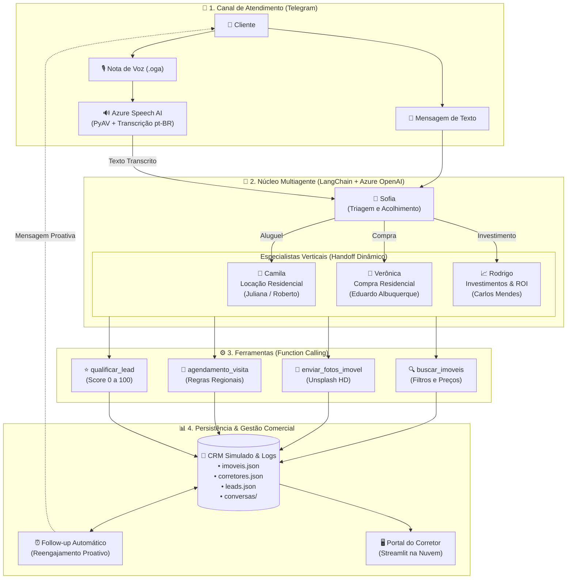

# Tech Challenge - Fase 5: Agente SDR Imobiliário com IA Generativa e Arquitetura Multiagente

Este repositório contém o projeto da Fase 5 do Tech Challenge (Pós-Tech IA para Devs - Hackathon FIAP). O objetivo deste projeto é transformar o processo comercial de uma imobiliária através da implementação de um Agente SDR (Sales Development Representative) inteligente, utilizando uma arquitetura multiagente com LangChain, serviços cognitivos em nuvem (Azure OpenAI e Azure Speech) e um portal de gestão em Streamlit para qualificação, follow-up e agendamento automático de visitas.

## 📺 Demonstração do Projeto
* **Link para o YouTube:** [INSERIR_LINK_DO_YOUTUBE_AQUI]
* **Apresentação:** Demonstração prática do atendimento automatizado via Telegram, orquestração multiagente em tempo real, Voice AI com transcrição de áudio via Azure Speech, motor de follow-up proativo e acompanhamento gerencial em Streamlit.

## 🛠️ Arquitetura do projeto
O ecossistema foi desenhado para atendimento conversacional em tempo real, qualificação preditiva de clientes e integração com a agenda de corretores humanos, unindo IA Generativa e serviços gerenciados em nuvem.

* **Integração em Nuvem (Azure):** Utilização do Azure OpenAI Service (`gpt-4.1-mini`) para raciocínio dos agentes e Function Calling, além do Azure Cognitive Services (Speech SDK) para transcrição de notas de voz em português brasileiro.
* **Orquestração Multiagente (LangChain):** Estrutura multiagente composta por 1 agente de triagem primária e 3 especialistas(compra, locação ou investimentos) orientadas pela intenção do lead.
* **Camada Conversacional e de Automação:** Bot assíncrono para Telegram com suporte multimídia (áudio e fotos), integrado a um calendário e um mecanismo de follow-up de reengajamento a cada 60 minutos por no máximo 2 vezes.
* **Portal de Acompanhamento (Dashboard):** Interface via Streamlit para corretores e gestores, exibindo funil comercial, KPIs, cards dos corretores vinculados aos seus agentes de IA e histórico completo das conversas em tempo real.
  


## 📋 Sobre a Evolução (Fase 5)

O foco desta fase foi a criação de um ecossistema comercial autônomo baseado em IA Generativa para solucionar o tempo de resposta e a sobrecarga operacional dos corretores, estruturado em três frentes principais:

### 1. Atendimento Conversacional e Multiagentes
Implementação de agentes verticais especializados construídos com LangChain e Function Calling:
* **Sofia (Triagem Primária):** Acolhe o cliente, identifica de imediato a intenção e transfere o atendimento ao agente responsável.
  * **Camila (Especialista em Locação):** Focada em agilidade locatícia e direcionamento regional exclusivo para **Roberto Prado** (Zona Oeste/Leste) e **Juliana Silveira** (Zona Sul/Norte).
  * **Verônica (Especialista em Compra Residencial):** Conduz a qualificação passo a passo para aquisição de imóveis e direciona para o corretor **Eduardo Albuquerque** (Compras Geral).
  * **Rodrigo (Especialista em Investimentos):** Assessoria analítica voltada a rentabilidade, ROI e locação de curta temporada (Airbnb), direcionando reuniões com **Carlos Mendes**.

### 2. Voice AI e Processamento Multimodal
Suporte completo a interações multimodais no canal de atendimento:
* **Transcrição de Áudio:** Pipeline com `PyAV` para decodificação uma vez que os áudios do telegram estão em formato `.oga/.ogg` e precisamos converter para WAV. E integração ao Azure Cognitive Services Speech SDK para transcrição rápida em português (`pt-BR`).
* **Envio de Fotos em Alta Resolução:** Ferramenta dedicada para envio imediato de carrosséis de imagens reais dos imóveis diretamente no chat do Telegram via Unsplash (free copyright).

### 3. Qualificação Preditiva, Agendamento e Follow-up
Automação do funil comercial e gestão em tempo real:
* **Score de Qualificação:** Algoritmo que calcula de 0 a 100 a temperatura do lead considerando orçamento, urgência e dados cadastrais.
* **Follow-up Automático Proativo:** Rotina em segundo plano com APScheduler que monitora leads sem resposta e reengaja com mensagens contextuais baseadas no histórico recente.
* **Portal do Corretor em Streamlit:** Dashboard com funil de vendas, métricas de conversão, divisão regional de corretores e visualização transparente de cada conversa.

---

## 📊 Resultados Obtidos e Exemplos de Conversação

### Triagem e Handoff Dinâmico para Locação (Camila)
O agente primário identifica a necessidade do cliente e transfere instantaneamente para a especialista em locação, mantendo a regra de uma pergunta por vez.


```text
[CLIENTE]: Olá, gostaria de alugar um apartamento na Zona Leste.
[ROTEAMENTO]: Lead transferido para Camila (Agente de Locação). Motivo: Interesse em aluguel na Zona Leste.

[CAMILA]: Olá, Kevin! Sou a Camila, agente especialista em locação da Imobiliária Prime. 
Excelente escolha! Para eu buscar as melhores opções na Zona Leste, qual é a sua faixa de orçamento mensal total (aluguel + condomínio)?
```

### Transição entre Modalidades (Compra) e Alocação de Corretor Humano
Quando o cliente muda de ideia durante a conversa, o sistema executa o *handoff* cruzado e aloca o corretor correto de acordo com a regra de negócio.


```text
[CLIENTE]: Mudei de ideia, prefiro ver opções de compra na Zona Sul.
[ROTEAMENTO]: Lead transferido para Verônica (Agente de Compra). Motivo: Mudança de interesse para compra residencial.

[VERÔNICA]: Olá, Kevin! Sou a Verônica, agente especialista em compra residencial da Imobiliária Prime.
Para confirmar, você procura um imóvel na Zona Sul com quantos dormitórios?
...
[VERÔNICA]: Tenho duas ótimas opções: Apartamento no Brooklin (R$ 890.000) e em Moema (R$ 1.250.000). 
Gostaria que eu agendasse uma visita com o nosso corretor responsável por compras, Eduardo Albuquerque?
```

### Transcrição de Áudio (Voice AI via Azure Speech)
O sistema processa notas de voz do Telegram, transcreve com alta fidelidade e responde contextualmente mantendo o fluxo natural.

```text
[VOICE AI]: Áudio recebido via Telegram (.oga) -> Convertido para WAV 16kHz mono.
[AZURE SPEECH]: Transcrição bem-sucedida: "Gostaria de saber se esse apartamento da Mooca tem vaga de garagem e piscina."
[CAMILA]: Sim! O apartamento na Mooca conta com 1 vaga de garagem coberta e lazer com piscina e academia. Quer dar uma olhada nas fotos?
```

### Portal do Corretor (Dashboard Streamlit)
A interface analítica exibe métricas em tempo real, funil de conversão e histórico detalhado das conversas:


Painel com métricas sobre os leads


## 📂 Estrutura do Projeto

```text
/
├── bot.py                       # Orquestrador enxuto do Telegram Bot (inicialização, rotas e polling)
├── agent.py                     # Orquestrador central LangChain (classe SDRImobiliarioAgent e sessões)
├── dashboard.py                 # Portal do Corretor em Streamlit (funil comercial, KPIs e chat)
├── Dockerfile                   # Configuração de container Docker unificado (Python 3.12 Slim + áudio)
├── docker-compose.yml           # Orquestrador de serviços e montagem de volumes para testes
├── entrypoint.sh                # Script de boot duplo (Bot em background + Streamlit na porta 8501)
├── .dockerignore                # Bloqueio de arquivos locais desnecessários ou sensíveis
├── utils/                       # Camada de serviços e componentização modular da solução
│   ├── __init__.py              # Exportação centralizada de utilitários e constantes
│   ├── prompts.py               # System Prompts dos Multiagentes (Sofia, Camila, Verônica, Rodrigo)
│   ├── tools.py                 # Schemas JSON e execução de Function Calling do LangChain
│   ├── voice.py                 # Pipeline de Voice AI (conversão PCM PyAV + Azure Speech SDK)
│   ├── catalog.py               # Catálogo de fotos em alta resolução (Unsplash) e busca de imagens
│   ├── handlers.py              # Manipuladores de eventos do Telegram (/start, texto, áudio e /followup)
│   ├── followup.py              # Motor proativo de follow-up automático e agendador em background
│   └── helpers.py               # Sistema de logging (bot.log), controle de acesso e persistência JSON
├── data/                        # Base de conhecimento e CRM simulado
│   ├── imoveis.json             # Catálogo simulado com 15 imóveis categorizados e fotos
│   ├── corretores.json          # Cadastro de corretores humanos, especialidades e agendas
│   └── leads.json               # CRM de leads com scores, histórico de follow-up e resumos
├── conversas/                   # Histórico persistente das conversas
│   ├── chat_[telegram_id].json  # Logs estruturados em formato JSON com separador de atendimento
│   └── chat_[telegram_id].txt   # Transcrição legível das interações
├── temp_audio/                  # Armazenamento temporário de áudios (.oga / .wav)
├── bot.log                      # Log estruturado de observabilidade e auditoria
├── requirements.txt             # Dependências e bibliotecas do ecossistema Python
└── README.md                    # Documentação completa da solução
```

### 🧩 Responsabilidade dos Módulos Principais

| Módulo / Arquivo | Responsabilidade Técnica |
| :--- | :--- |
| **`bot.py`** | Ponto de entrada do bot Telegram. Responsável por carregar variáveis de ambiente, registrar os manipuladores de eventos e ativar a job queue periódica de follow-up. |
| **`agent.py`** | Núcleo do Agente SDR. Instancia o modelo `AzureChatOpenAI`, gerencia as sessões conversacionais dos leads em memória e orquestra o ciclo de raciocínio com LangChain. |
| **`utils/prompts.py`** | Define as personas dos multiagentes (Sofia para triagem, Camila para locação, Verônica para compra e Rodrigo para investimentos), garantindo a regra estrita de uma pergunta por vez. |
| **`utils/tools.py`** | Implementa as ferramentas acionadas pela IA via Function Calling: busca de imóveis, consulta de agendas, confirmação de agendamentos e qualificação de leads. |
| **`utils/voice.py`** | Pipeline de Voice AI: converte notas de voz do Telegram (.oga/.ogg) para WAV PCM 16kHz mono via PyAV e realiza transcrição com o Azure Cognitive Services Speech SDK. |
| **`utils/catalog.py`** | Mapeamento e recuperação de fotos oficiais em alta resolução dos 15 imóveis do catálogo para envio imediato no chat via Unsplash. |
| **`utils/handlers.py`** | Processa os eventos recebidos do Telegram: comando `/start` (reinício de sessão), mensagens de texto, notas de voz e comando `/followup`. |
| **`utils/followup.py`** | Motor de reengajamento inteligente. Monitora inatividade dos leads e envia mensagens automáticas mantendo o contexto histórico da conversa. |
| **`utils/helpers.py`** | Funções utilitárias transversais: configuração de logger simultâneo (console + bot.log), controle de acesso por ID e persistência atômica de JSON. |
| **`dashboard.py`** | Portal do Corretor construído em Streamlit. Exibe funil de vendas, métricas de qualificação, cards de corretores vinculados aos seus agentes de IA e histórico completo de chat. |


## 🚀 Guia de Execução

### Pré-requisitos
* Python 3.10 ou superior instalado.
* Dependências instaladas (`pip install -r requirements.txt`).
* Arquivo `.env` na raiz do projeto configurado com as chaves de acesso:
  * `TELEGRAM_BOT_TOKEN`: Token do bot obtido via BotFather no Telegram.
  * `AZURE_OPENAI_API_KEY`: Chave do recurso Azure OpenAI.
  * `AZURE_OPENAI_ENDPOINT`: Endpoint do recurso Azure OpenAI.
  * `AZURE_OPENAI_DEPLOYMENT_NAME`: Nome do deployment (ex: `gpt-4.1-mini`).
  * `AZURE_OPENAI_API_VERSION`: Versão da API (ex: `2024-08-01-preview`).
  * `AZURE_SPEECH_KEY`: Chave do Azure Cognitive Services Speech.
  * `AZURE_SPEECH_REGION`: Região do serviço de fala (ex: `eastus2`).

### Passo 1: Inicializar o Bot do Telegram
No terminal principal, execute o bot para iniciar o atendimento e o motor de follow-up:
```bash
python bot.py
```

### Passo 2: Inicializar o Portal do Corretor (Dashboard)
Em um segundo terminal, execute o dashboard Streamlit:
```bash
streamlit run dashboard.py --server.port 8501
```
Acesse no navegador: `http://localhost:8501`

### Passo 3: Interagir com o Bot no Telegram
1. Abra o seu bot no Telegram e envie o comando `/start`.
2. Converse enviando texto ou notas de voz para testar a triagem, troca de especialidades, envio de fotos e agendamento de visitas.
3. Acompanhe a atualização instantânea do lead e do histórico no painel do Streamlit.

---

## ☁️ Deploy em Nuvem (Microsoft Azure Container Apps)

Para atender ao diferencial de **Deploy em Nuvem**, a solução foi conteinerizada com Docker unificado (executando o Streamlit na porta `8501` e o Bot Telegram em segundo plano com compartilhamento de dados).

### Deploy Rápido via Azure Cloud Shell (Sem precisar instalar Docker no PC)

1. Acesse o [Portal da Azure](https://portal.azure.com/) e abra o **Cloud Shell** (`>_`) no menu superior (selecione ambiente **Bash**).
2. Clone o repositório do projeto:
```bash
git clone https://github.com/SEU_USUARIO/tech_c_fase5.git
cd tech_c_fase5
```

3. Crie o Grupo de Recursos e faça o build/deploy automático com um comando:
```bash
# 1. Criar Resource Group no Brasil (brazilsouth) ou EUA (eastus2)
az group create --name rg-sdr-imobiliario --location brazilsouth

# 2. Compilar na nuvem e publicar no Azure Container Apps
az containerapp up \
  --name sdr-imobiliario-app \
  --resource-group rg-sdr-imobiliario \
  --location brazilsouth \
  --ingress external \
  --target-port 8501 \
  --source .
```

4. Configure as variáveis de ambiente secretas no Container App:
```bash
az containerapp update \
  --name sdr-imobiliario-app \
  --resource-group rg-sdr-imobiliario \
  --set-env-vars \
    TELEGRAM_BOT_TOKEN="SEU_TOKEN_TELEGRAM" \
    AZURE_OPENAI_API_KEY="SUA_CHAVE_OPENAI" \
    AZURE_OPENAI_ENDPOINT="SEU_ENDPOINT_OPENAI" \
    AZURE_OPENAI_DEPLOYMENT_NAME="gpt-4.1-mini" \
    AZURE_OPENAI_API_VERSION="2024-08-01-preview" \
    AZURE_SPEECH_KEY="SUA_CHAVE_SPEECH" \
    AZURE_SPEECH_REGION="eastus2"
```

### 💡 Gestão de Custos: Pausar e Reativar o Container
Para evitar qualquer cobrança residual quando a aplicação não estiver em uso ou avaliação:
```bash
# Pausar o container (Custo R$ 0,00)
az containerapp stop --name sdr-imobiliario-app --resource-group rg-sdr-imobiliario

# Reativar quando for apresentar
az containerapp start --name sdr-imobiliario-app --resource-group rg-sdr-imobiliario
```

---

## ✒️ Autor - Kevin Makoto Shiroma
Projeto desenvolvido como parte da avaliação do **Tech Challenge - Fase 5 (Hackathon)**.
